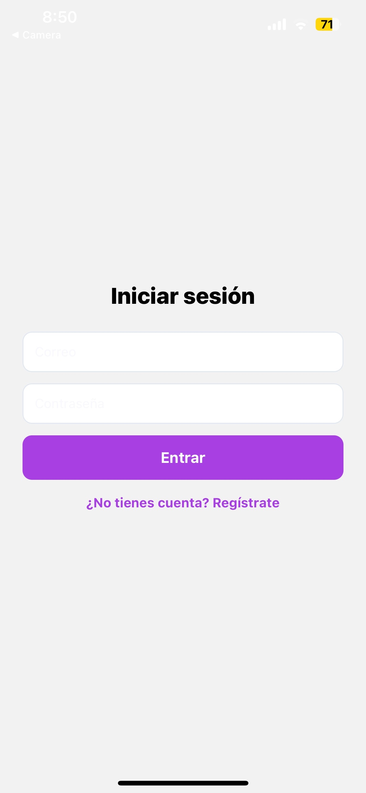
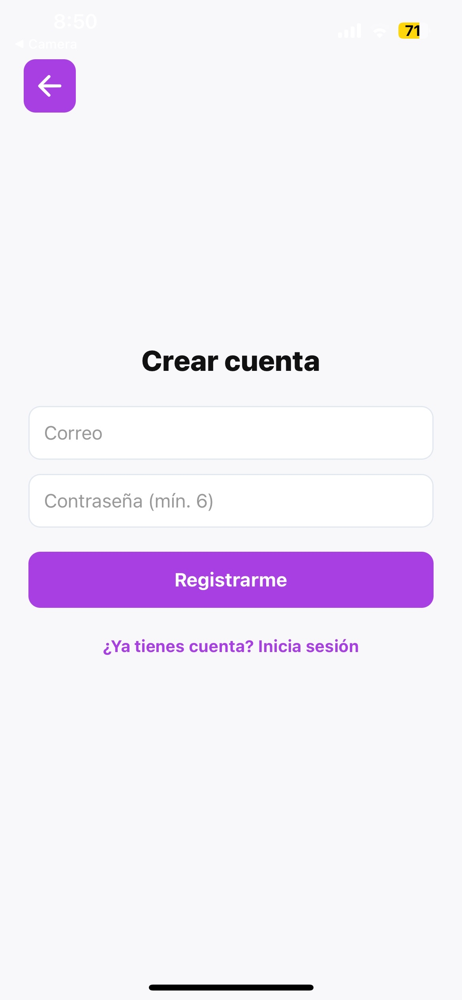
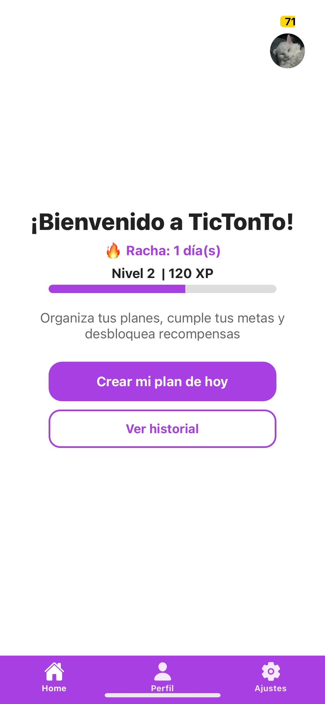
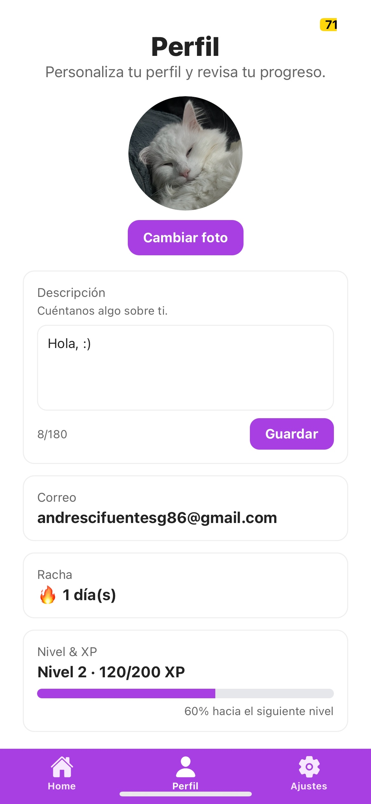
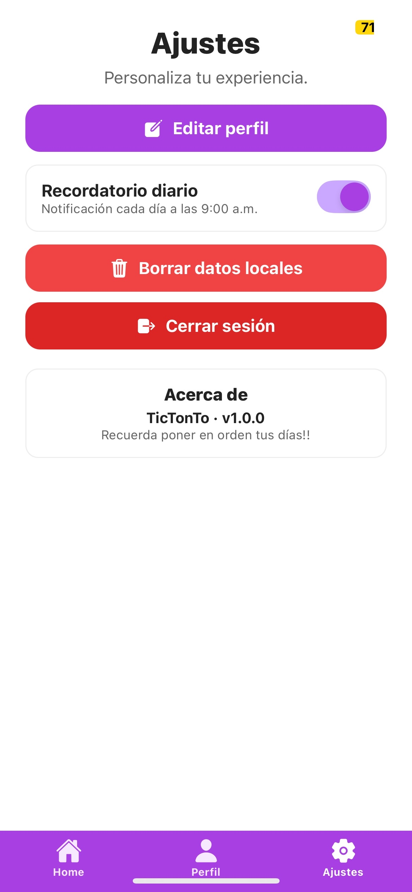
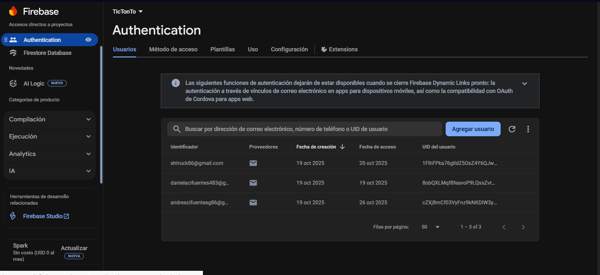
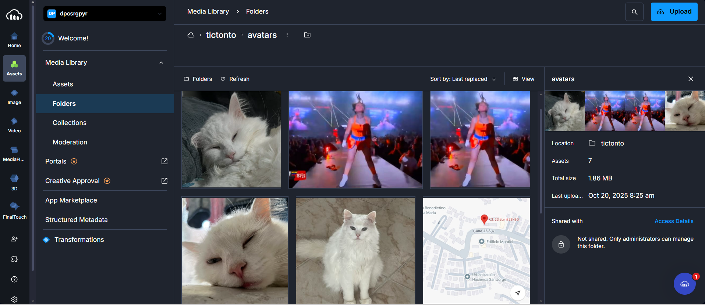
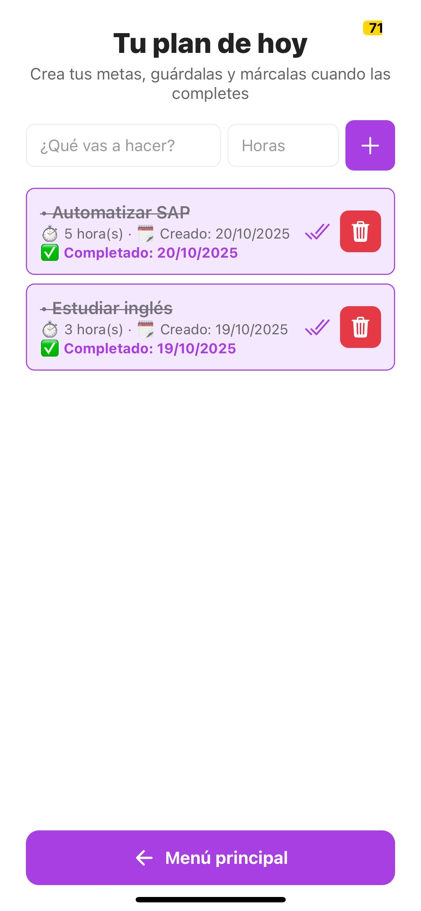

# TicTonTo

TicTonTo es una aplicación móvil creada para ayudar a organizar el tiempo de forma práctica. Permite registrar tareas, ver el progreso y mantener la motivación con un estilo similar a Duolingo.

## Objetivo
Desarrollar una app que ayude a gestionar tareas y hábitos diarios, usando almacenamiento local y en la nube.

## Tecnologías utilizadas
- React Native (Expo)
- Firebase Authentication (correo y contraseña)
- SQLite (base de datos local)
- Cloudinary (almacenamiento de imágenes)
- React Navigation (manejo de pantallas)
- JavaScript

## Funcionalidades principales
- Registro e inicio de sesión con Firebase.
- Base de datos local con SQLite para guardar tareas.
- Subida de imágenes con Cloudinary.
- Navegación entre pantallas con React Navigation.
- Lógica de gestión de tareas (crear, listar, marcar como completadas).

## Servicios configurados
- **Firebase:** 
- **SQLite:** 
- **Cloudinary:** 

## Próximos pasos
- Agregar sincronización con Firestore.
- Mejorar la interfaz visual.
- Añadir notificaciones y sistema de recompensas.

## Evidencias Visuales

### Pantallas principales

### Perfil y Ajustes

### Servicios integrados

